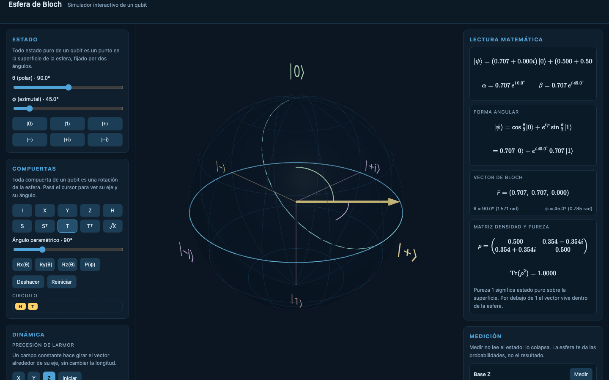

# Bloch Sphere Simulator

An interactive, educational simulator of a single qubit on the Bloch sphere. Apply gates as animated rotations, measure, watch decoherence, and read the underlying math live.

The UI is in Spanish; code and identifiers are in English.



## Run it

Requires Node.js 20+ and [pnpm](https://pnpm.io).

```bash
pnpm install
pnpm dev
```

Then open http://localhost:5173.

```bash
pnpm build
pnpm preview
```

## What each panel teaches

- **Estado**: set the state through the polar angle theta and the azimuth phi, or jump to the six cardinal states. Shows how any pure state maps to a point on the sphere.
- **Compuertas**: every fixed gate plus parametric Rx, Ry, Rz and P. Each gate is animated as a rigid rotation around its axis, with a tooltip showing its matrix, axis and angle. A mini circuit records the history and supports undo.
- **Lectura matematica**: live KaTeX readout of the ket in rectangular and polar form, the cos/sin form with numbers substituted, the Bloch vector, angles, density matrix and purity.
- **Medicion**: probabilities in the X, Y and Z bases, single measurement with state collapse, and repeated shots comparing experimental and theoretical frequencies.
- **Dinamica**: Larmor precession about a chosen axis, and relaxation (T1, T2, depolarizing) where the vector shrinks into the sphere as the state becomes mixed.
- **Lecciones**: step-by-step lessons with auto-checked challenges, from what a qubit is up to mixed states and decoherence.

## Architecture

- `src/quantum/`: pure, immutable domain logic (complex numbers, matrices, gates, measurement, density matrices, channels). No UI dependencies.
- `src/sphere/`: react-three-fiber scene. Physics coordinates are Z-up; three.js is Y-up, mapped in one place.
- `src/store/`: zustand app state.
- `src/panels/`, `src/lessons/`: UI panels and lesson content.

Built with Vite, React, TypeScript, three.js, @react-three/fiber, drei, KaTeX and zustand.
